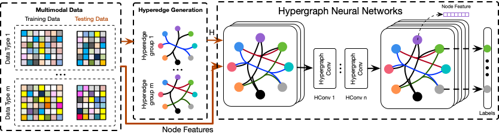

## News
We have release a deep learning toolbox named DHG for graph neural networks and hypergraph neural networks. You can find many intresting things in it. Many correlation structures like simple graph, directed graph, bipartite graph, and simple hypergraph are all supported in the toolbox, as well as their visualization. More details refer to [DHG](https://github.com/iMoonLab/DeepHypergraph)!

## Hypergraph Neural Networks
Created by Yifan Feng, Haoxuan You, Zizhao Zhang, Rongrong, Ji, Yue Gao from Xiamen University and Tsinghua University.



### Introduction
This work will appear in AAAI 2019. We proposed a novel framework(HGNN) for data representation learning, which could take multi-modal data and exhibit superior performance gain compared with single modal or graph-based multi-modal methods. You can also check our [paper](http://gaoyue.org/paper/HGNN.pdf) for a deeper introduction.

HGNN could encode high-order data correlation in a hypergraph structure. Confronting the challenges of learning representation for complex data in real practice, we propose to incorporate such data structure in a hypergraph, which is more flexible on data modeling, especially when dealing with complex data. In this method, a hyperedge convolution operation is designed to handle the data correlation during representation learning. In this way, traditional hypergraph learning procedure can be conducted using hyperedge convolution operations efficiently. HGNN is able to learn the hidden layer representation considering the high-order data structure, which is a general framework considering the complex data correlations.

In this repository, we release code and data for train a Hypergrpah Nerual Networks for node classification on ModelNet40 dataset and NTU2012 dataset. The visual objects' feature is extracted by [MVCNN(Su et al.)](http://vis-www.cs.umass.edu/mvcnn/docs/su15mvcnn.pdf) and [GVCNN(Feng et al.)](http://openaccess.thecvf.com/content_cvpr_2018/papers/Feng_GVCNN_Group-View_Convolutional_CVPR_2018_paper.pdf).


### Citation
if you find our work useful in your research, please consider citing:

    @article{feng2018hypergraph,
      title={Hypergraph Neural Networks},
      author={Feng, Yifan and You, Haoxuan and Zhang, Zizhao and Ji, Rongrong and Gao, Yue},
      journal={AAAI 2019},
      year={2018}
    }

### Installation
Install [Pytorch 0.4.0](https://pytorch.org/). You also need to install yaml. The code has been tested with Python 3.6, Pytorch 0.4.0 and CUDA 9.0 on Ubuntu 16.04.

### Usage

**Firstly, you should download the feature files of modelnet40 and ntu2012 datasets.
Then, configure the "data_root" and "result_root" path in config/config.yaml.**

Download datasets for training/evaluation  (should be placed under "data_root")
- [ModelNet40_mvcnn_gvcnn_feature](https://drive.google.com/file/d/1euw3bygLzRQm_dYj1FoRduXvsRRUG2Gr/view?usp=sharing)
- [NTU2012_mvcnn_gvcnn_feature](https://drive.google.com/file/d/1Vx4K15bW3__JPRV0KUoDWtQX8sB-vbO5/view?usp=sharing)


To train and evaluate HGNN for node classification:
```
python train.py
```
You can select the feature that contribute to construct hypregraph incidence matrix by changing the status of parameters "use_mvcnn_feature_for_structure" and "use_gvcnn_feature_for_structure" in config.yaml file. Similarly, changing the status of parameter "use_gvcnn_feature" and "use_gvcnn_feature" can control the feature HGNN feed, and both true will concatenate the mvcnn feature and gvcnn feature as the node feature in HGNN.

```yaml
# config/config.yaml
use_mvcnn_feature_for_structure: True
use_gvcnn_feature_for_structure: True
use_mvcnn_feature: False
use_gvcnn_feature: True
```
To change the experimental dataset (ModelNet40 or NTU2012)
```yaml
# config/config.yaml
#Model
on_dataset: &o_d ModelNet40
#on_dataset: &o_d NTU2012
```
### License
Our code is released under MIT License (see LICENSE file for details).

